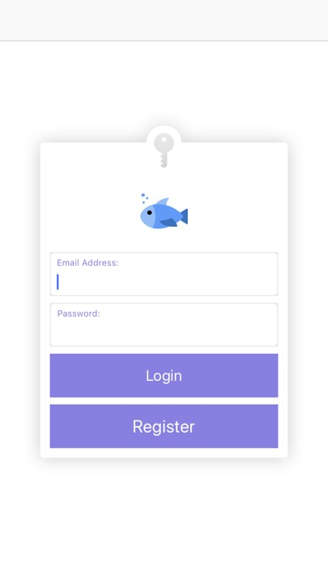
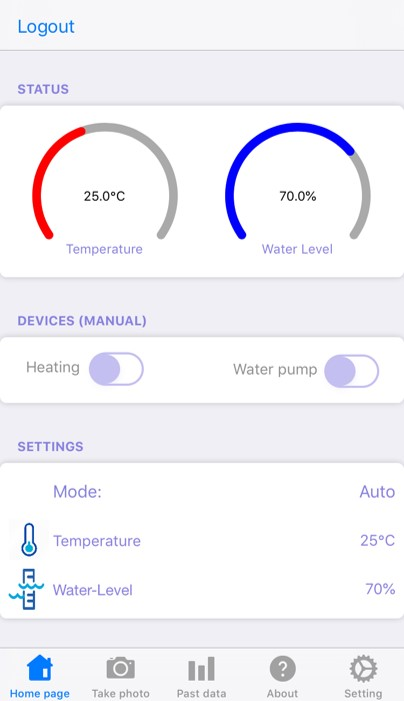
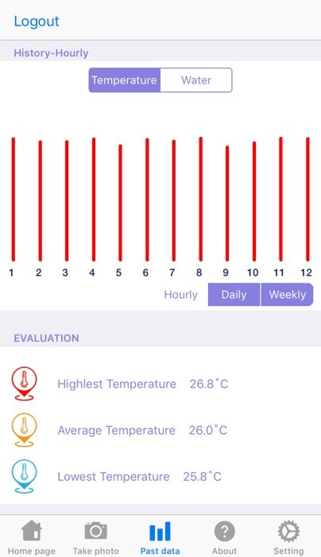
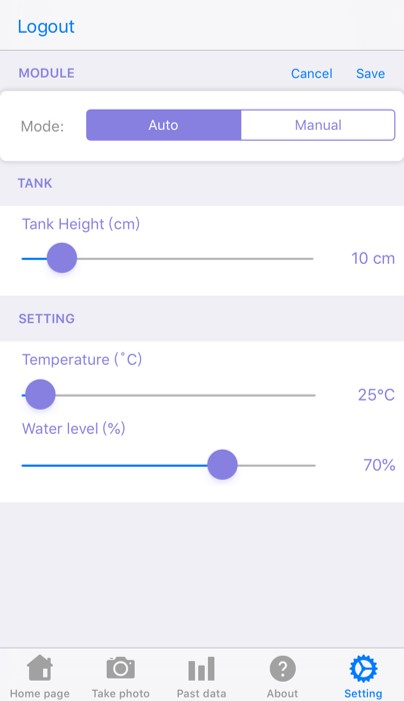
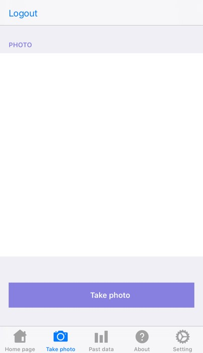

# StayingAlive

StayingAlive was a university project which required us to create an iOS application which works in conjunction with the IoT device we had created.
The IoT device I created was a fish tank monitor that automatically adjusted temperature and water level for a fish tank. 
It utilised a Raspberry Pi, temperature sensor, ultrasonic range sensor, water pump and heating device to look after your fish tank.

Here are some screenshots of the iOS application

#### Login menu
The login verifies with the Firebase database to retrieve the correct data for the user

#### Home screen
The 2 gauges update in real-time based on the values collected by the IoT sensors. If the user sets their settings to 'manual', 
the 2 devices buttons will become active and allow the user to manually turn on or off the heating device and water pump. 

#### Historic data
Users can view their fish tanks historic water level and temperatures.

#### Settings
Users can set their water tank height and what temperature and water level they would like the device to maintain their water tank 
at.

#### Camera 
The IoT device had a camera attached which allows the users to remotely take a photo to view their fish tank.

